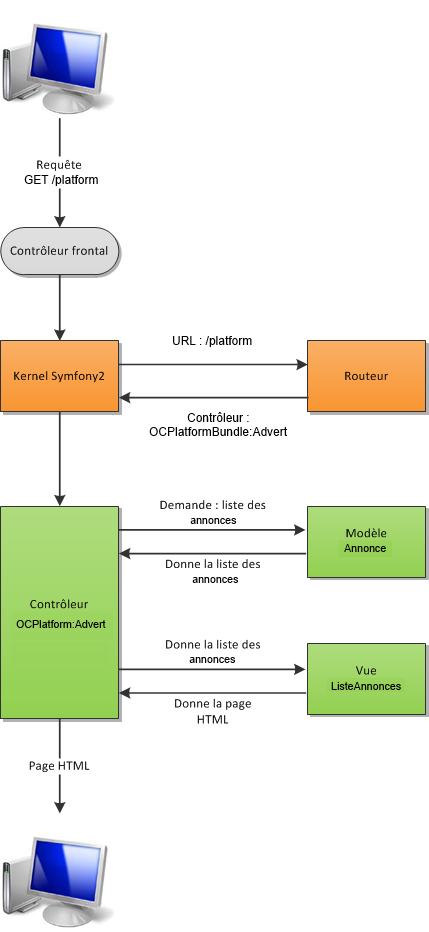
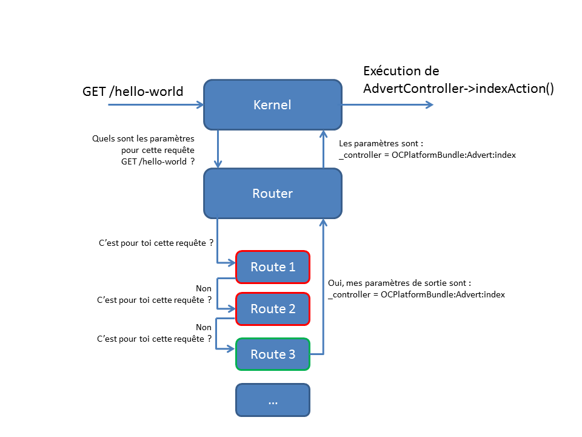

:MAIN_TITLE: Symfony 3

include::_partials/adoc-config.adoc[]

== Présentation

Symfony est un framework PHP créé par Fabien Potentier et éditer par la sotiété SensioLabs.

NOTE: Un framework sert à améliorer la productivité des développeurs

|===
|Version maintenue de Sf |Date de sortie |Version min de PHP requis
|Symfony 1      |2005 |
|Symfony 2.8    |2011 |PHP 5.3.9
|Symfony 3.4    |2015 |PHP 5.5.9
|Symfony 4.0    |2018 |PHP 7.1.3
|===

== Création d'un nouveau projet

[source,bash]
----
$ symfony new my_project_name 3.4

# Use the most recent 'lts' version (Long Term Support version)
$ symfony new my_project_name lts
----

== L'architecture de Symfony

----
.
|-- app/        # Configuration & Templates
|-- bin/        # Exécutables (commandes PHP, bin\console, ...)
|-- src/        # Code source (bundles, ...)
|-- tests/      # Tests unitaires
|-- var/        # Logs, cache, ...
|-- vendor/     # Libs externes
`-- web/        # Fichiers destinés aux visiteurs (img, css, js)
                # Contrôleurs frontaux `app.php` & `app_dev.php`
----

=== Mode dev & debug

TIP: Vous pouvez avoir accès à l'outils profiler en allant sur  http://localhost/my_new_project/web/app_dev.php/_profiler

TIP: En production, les erreurs sont loggées dans le fichier `var/logs/prod.log`

== L'architecture basique conceptuelle MVC

- `M` pour `Model` : Gestion des données et des contenus.
- `V` pour `View` : Affichage des pages.
- `C` pour `Controller` : Analyse et traitement de la requête HTTP.

=== Parcours d'une requête dans Symfony

== Les bundles

NOTE: Un bundle est une brique de l'application. Il contient tout ce qui concerne une même fonctionnalité (contrôleurs, modèles, vues, css, js, ...).

TIP: http://knpbundles.com regroupe persque tous les bundles de la communauté Symfony.

=== Structure d'un bundle

----
.
|-- Controller/                 # Contrôleurs de l'application
|-- DependencyInjection/        # Information du bundle
|-- Entity/                     # Modèles
|-- Form/                       # Formulaires
`-- Resources/
    |-- config/                 # Configuration du bundle (ex: routes)
    |-- public/                 # Fichiers publics (css, js, images, ...)
    `-- views/                  # Vues du bundles (Twig)
----

=== Création d'un bundle avec la console

WARNING: Il y a une différence de commande entre la version 2 et 3 de Symfony pour l'exécutable.

[source,bash]
----
$ php bin/console generate:bundle   # Symfony 3
$ php app/console generate:bundle   # Symfony 2
----

==== Génération du bundle

[source,bash]
----
$ php bin/console generate:bundle
----

Le générateur va poser plusieurs questions :

[source,bash]
----
# 1 - Cadre de réutilisation du bundle
Are you planning on sharing this bundle across multiple applications? [no]:yes

# 2 - Choix du namespace
Bundle namespace: OC/PlatformBundle

# 3 - Choix du nom
Bundle name [OCPlatformBundle]:_

# 4 - Choix de la destination
Target Directory [src/]:_

# 5 - Choix du format de configuration
Configuration format (annotation, yml, xml, php) [xml]:_
----

Symfony a généré la structure du bundle dans le répertoire `src/OC/PlatformBundle`.

TIP: Le seul fichier obligatoire pour la création du bundle est la classe à la racine `OCPlatformBundle.php`

[source,php]
----
<?php
namespace OC\PlatformBundle;

use Symfony\Component\HttpKernel\Bundle\Bundle;

class OCPlatformBundle extends Bundle
{
}
----

Il a aussi enregistré le bundle auprès du Kernel `app/AppKernel.php`.

Le bundle dispose de ses propres routes :

.src/OC/PlatformBundle/Resources/config/routing.yml
----
oc_platform_homepage:
    path:       /
    defaults:   { _controller: OCPlatformBundle:Default:index } <1>
----
<1> `OCPlatformBundle:Default:index` pointe le controlleur `src/OC/PlatformBundle/Controller/DefaultController.php`.

Ce fichier est ensuite importé dans le fichier de routing global de l'application. Symfony a aussi généré ces lignes de configuration.

.app/config/routing.yml
----
oc_platform :
    resource:   "@OCPlatformBundle/Resources/config/routing.yml"
    prefix:     /
----

== Activation de la toobar

La toolbar est un bout de code HTML que rajoute Symfony à chaque page... contenant la balise `</body>`. Insérer cette balise dans le template du bundle fraîchement créé :

.src/OC/PlatformBundle/Resources/vews/Default/index.html.twig
[source,html]
----
<html>
    <body>
        Hello World!
    </body>
</html>
----

Actualisez la page : la toobar apparaît en bas de page.

== Interview

Premier développement de symfony à la sortie de PHP 5 en 2003.

Symfony 2 est basé sur HTTP et les bonnes pratiques autour de l'injection de dépendance.

Il y a un business model double autour :

. du service
. des produits en Saas

Exemples de produits :

- https://insight.sensiolabs.com[SensioLabs Insight] permet de vérifer que les bonnes pratiques soient bien implémentées. Permet de mesurer la qualité et la dette technique d'un projet.
- https://blackfire.io/[Blackfire] permet de gérer la performance d'un site web.

== Hello World! (les bases)

=== Le routeur

==== Qu'est-ce un routeur ?

NOTE: l'objectif du routeur est de faire la correspondance entre une URL et des paramètres.

Figure synthétique du routeur :

==== Création du routeur

NOTE: l'exemple est réalisé dans le cadre du bundle `src/OC/PlatformBundle`

.src/OC/PlatformBundle/Resources/config/routing.yml
----
hello_the_world:
    path:       /hello-word
    defaults:   { _controller: OCPlatformBundle:Advert:index }
----

- `OCPlatformBundle:Advert:index` => `Bundle:Controller:Action` 

=== Le contrôleur

Création de base du contrôleur :

.src/OC/PlatformBundle/Controller/AdvertController.php
[source,php]
----
namespace OC\PlatformBundle\Controller;

use Symfony\Component\HttpFoundation\Response;

class AdvertController
{
    public function indexAction()
    {
        return new Response("Hello World!");
    }
}
----

=== Le template Twig

NOTE: Twig est un moteur de template. Il permet d'afficher le contenu des pages HTML de façon dynamique, mais sans PHP.

Création de base du template Twig :

.src/OC/PlatformBundle/Resources/views/Advert/index.html.twig
[source,html]
----
<!DOCTYPE html>
<html>
  <head>
    <title>Message d'accueil</title>
  </head>
  <body>
    <h1>Hello {{ nom }}</h1>
  </body>
</html>
----

Il faut faire hériter notre premier contrôlleur du contrôleur de base Symfony :

.src/OC/PlatformBundle/Controller/AdvertController.php
[source,php]
----
namespace OC\PlatformBundle\Controller;

use Symfony\Bundle\FrameworkBundle\Controller\Controller;
use Symfony\Component\HttpFoundation\Response;

class AdvertController extends Controller
{
    public function indexAction()
    {
        $content = $this
            ->get('template')
            ->render('OCPlatformBundle:Advert:index.html.twig', ['nom' => 'JP']);
        return new Response($content); // Hello JP
    }
}
----

NOTE: Pour voir le résultat, il suffit d'afficher dans le navigateur la page `http://localhost/my_projetc/web/app_dev.php/hello-word`

== Le cache

IMPORTANT: Penser à vider le cache

[source,bash]
----
$ php bin/console cache:clear               # dev
$ php bin/console cache:clear --env=prod    # prod
----

TIP: Si nécessaire, il est possible de supprimer directement les fichiers dans le dossier `var/cache/dev` ou `var/cache/prod`

== Le routeur

=== Exemples simples

.src/OC/PlatformBundle/Resources/config/routing.yml
----
oc_platform_home:
    path:   /platform
    defaults: { _controller: OCPlatformBundle:Advert:index }

oc_platform_view:
    path:   /platform/advert/{id}
    defaults: { _controller: OCPlatformBundle:Advert:view }

oc_platform_add:
    path:   /platform/add
    defaults: { _controller: OCPlatformBundle:Advert:add }
----

NOTE: Si le routeur ne trouve aucune route correspondantes, le noyau de Symfony déclenche une erreur 404.

=== Exemples avec des routes plus complexes

.src/OC/PlatformBundle/Resources/config/routing.yml
----
oc_platform_view_slug:
    path: /platform/{year}/{slug}.{format} <1>
    defaults:
        _controller: OCPlatformBunlde:Advert:viewSlug
        format: html <2>
    requirements:
        year:   \d{4} <3>
        format: html|xml <4>
----
<1> La route fait la correcpondance à partir du nom des variables utilisées, et non à partir de l'ordre des arguments de `viewSlugAction` (Voir AdvertController.php)
<2> l'URL interceptée sera au format `html` par défault : `/platform/2011/webmaster` => `/platform/2011/webmaster.html`
<3> `year` ne peut avoir que 4 chiffres à la suite
<4> Seules les URLs de type `/platform/2011/webmaster.html` ou `/platform/2011/webmaster.xml` seront acceptées

.src/OC/PlatformBundle/Controller/AdversController.php
[source,php]
----
namespace OC\PlatformBundle\Controller;

use Symfony\Bundle\FrameworkBunlde\Controller\Controller;
use Symfony\Component\HttpFoundation\Response;

class AdvertController extends Controller
{
    public function viewSlugAction($slug, $year, $format) <1>
    {
        return new Response($slug . ' - ' . $year . ' - ' . $format);
    }
}
----
<1> La route fait la correcpondance à partir du nom des variables utilisées, et non à partir de l'ordre des arguments de `viewSlugAction` (Voir routing.yml)

== Ressources

- https://openclassrooms.com/fr/courses/3619856-developpez-votre-site-web-avec-le-framework-symfony
- https://symfony.com/doc/3.4/setup.html

{BACK_TO_TOP}
